# Gerador de Nota Fiscal

API síncrona que recebe um pedido e devolve a nota fiscal correspondente: conferência do total, alíquota e frete, depois quatro integrações (estoque, registro, entrega e financeiro).

Este repositório é o **case de notas fiscais**. O enunciado original — problemas conhecidos, premissas e restrições — está em [`CASE.md`](CASE.md). A solução abaixo evolui o legado sem alterar o contrato JSON de entrada e sem remover os `sleep` simulados das integrações (380 / 500 / 150 / 250 / 200 ms).

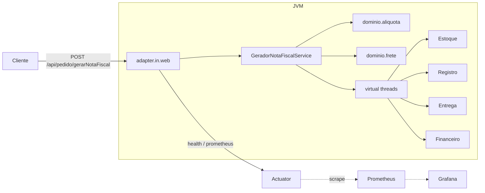

Stack: **Java 21**, **Spring Boot 4**, Docker Compose. Decisões e trade-offs em [`docs/adr/`](docs/adr/).

---

## Como executar

```bash
docker compose up --build
# API em http://127.0.0.1:8080
# POST /api/pedido/gerarNotaFiscal
```

Unidade + cobertura (JaCoCo, mínimo 95% linha e branch no bundle):

```bash
./mvnw test
```

TaaC (Bruno) e carga (k6) esperam a API no Compose e aguardam `/actuator/health/liveness`:

```bash
./tests/taac/run.sh
./tests/carga/run.sh          # smoke, sequencial, pedido-grande, carga
./tests/carga/run.sh smoke    # um cenário
```

Observabilidade visual (Prometheus `:9090`, Grafana `:3000`, dashboard *Gerador NF*):

```bash
docker compose --profile metrics up --build
```

---

## Entrega funcional

O legado acumulava itens entre requests (lista compartilhada) e devolvia valores que não fechavam com o pedido. A API hoje isola cada request, confere o total antes de calcular e aplica tributo e frete em `BigDecimal`.

| Problema | O que mudou |
| --- | --- |
| Itens de um pedido apareciam no seguinte | A lista de itens da nota deixou de ser estado estático. Cada `gerarNotaFiscal` monta a própria coleção. |
| `valor_total_itens` não batia com as linhas | Conferência no gerador: soma `unitário × quantidade` contra o total informado. Divergência → **422** (`PedidoInvalidoException`), antes de frete e alíquota. |
| Tributo ignorava quantidade | Tributo da linha = `valorUnitario × quantidade × aliquota`, 2 casas `HALF_UP`. `valor_total_itens` continua subtotal de mercadoria — tributo **não** entra nesse campo. |
| Centavos inconsistentes (`double`) | Dinheiro, alíquota e fator de frete em `BigDecimal` (literais `String`, `compareTo`, `WRITE_BIGDECIMAL_AS_PLAIN`). |
| Payload tinha `bairro` / `cidade` e o model não | Campos no `Endereco`, com trim na sanitização. |
| Data da nota em UTC no container | Fuso `America/Sao_Paulo` (`TZ` + `-Duser.timezone`). |
| Payload incompleto ou só espaços | Sanitização (`trim` / branco → `null`) + Bean Validation. Contrato inválido → **400** Problem Details (RFC 9457). |
| PJ `OUTROS` e regra de negócio | Exceptions de domínio; regime não suportado e total divergente → **422**. |

O JSON de entrada permanece o mesmo. Os `sleep` das laterais permanecem: a otimização não foi apagar a latência simulada.

---

## Entrega de performance

Dois defeitos distintos no legado: um `sleep` extra de 5 s em pedido com mais de 5 itens, e as quatro integrações em série (~1480 ms). O teto útil hoje é o **máximo** das laterais (~500 ms, o registro), não a soma.

| Problema | O que mudou |
| --- | --- |
| Pedido com 6+ itens ~5 s a mais | Removido o delay artificial acoplado à quantidade de itens. |
| Integrações em sequência | `Executors.newVirtualThreadPerTaskExecutor()` por request + `ExecutorCompletionService`. Fail-fast: primeira falha cancela as demais (`cancel(true)`). |
| Thread do Tomcat ocupada no `join` | `spring.threads.virtual.enabled=true`: a thread HTTP que espera o `take()` também é virtual. |
| Números irreproduzíveis no host | Compose com `cpus: "0.50"` e `mem_limit: 512m`; JVM com `-XX:MaxRAMPercentage=75.0`. |

Carga no mesmo limite de recurso (8 VUs, 30 s, check de status + um item + tributo): **480** requests, **0** falhas, p95 **~507 ms**, ~15,8 req/s — alinhado ao `sleep` de 500 ms do registro, não à soma das quatro.

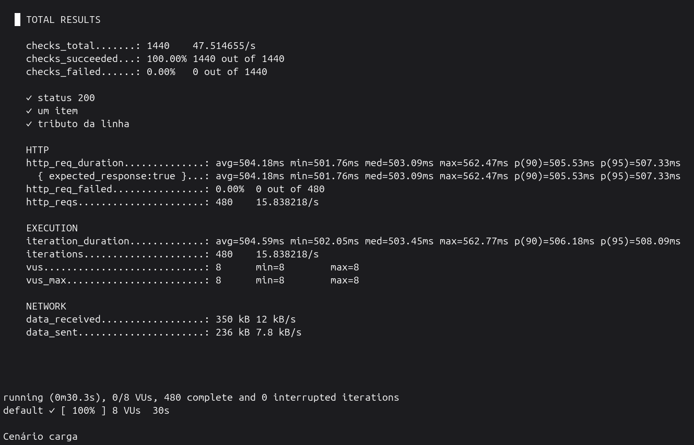

Pedido com 6 itens: p95 **~503 ms** (três iterações, 0 falhas). Não há mais o salto de 5 s.

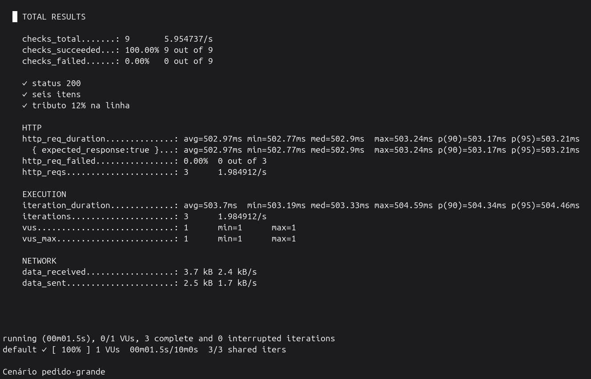

Smoke (PF + PJ) e sequencial (8 POSTs, assert de que não acumula itens) ficam na mesma faixa de ~503 ms:

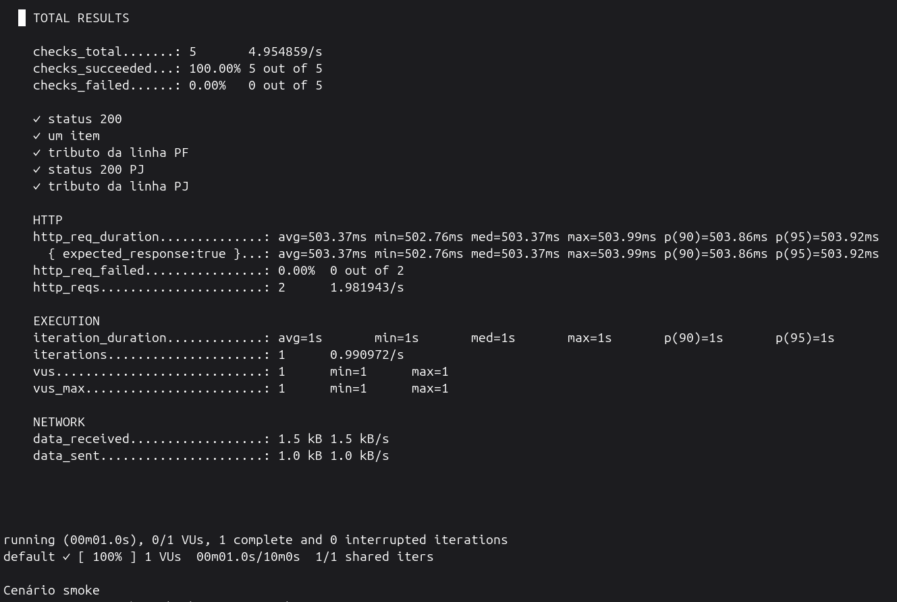

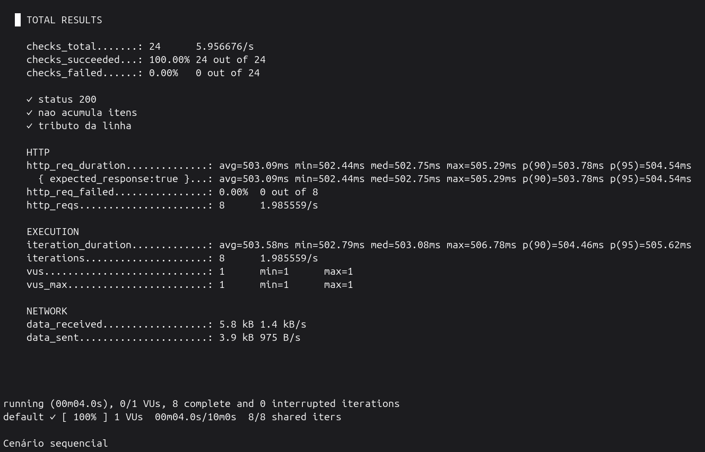

---

## Entrega de manutenibilidade e qualidade de código

O gerador legado concentrava alíquota, frete, `new` das integrações e efeitos colaterais. A fatia atual separa orquestração, regra e I/O, trava regressão no Maven e registra o porquê em ADR.

| Frente | O que mudou |
| --- | --- |
| Runtime | Java 21 + Spring Boot 4. Virtual threads são GA (JEP 444), não preview. |
| Empacotamento | `Dockerfile` multi-stage (Temurin 21), usuário não-root, Compose reproduzível. |
| Dependências | Interfaces + DI. Só entrega tem Port/Adapter; as outras laterais ainda são `*ServiceImpl` com `sleep`. |
| Alíquota | Strategy por PF / Simples / Lucro Real / Lucro Presumido. Nova faixa vira classe, não `if` no gerador. |
| Frete | Fator no enum `Regiao` (conjunto fechado do JSON). Sem endereço de entrega → 422, não frete 0 silencioso. |
| Model | Classes compartilhadas na raiz do pacote: o contrato JSON *é* o vocabulário do domínio (sem DTO 1:1). |
| HTTP | Adapter com RFC 9457; sanitização no `RequestBodyAdvice`. |
| Decisões | ADRs em `docs/adr/` (Docker, TaaC/k6, DI, strategy, frete, model, validação, virtual threads, BigDecimal, observabilidade). |
| Testes | Pacotes alinhados ao código de produção; gate JaCoCo **95%** linha e branch. |

```
adapter.in.web          HTTP, filtro requestId, Problem Details, sanitização
adapter.out             integração de entrega + observabilidade (métricas, MDC)
domain.aliquota         strategies + calculadora de linha
domain.frete            fator por região
domain.exception        pedido inválido, regime não suportado
service                 porta de entrada e orquestração + sleeps simulados
model                   contrato JSON compartilhado
```

---

## Testes

Três camadas, com papéis diferentes: o Maven cobre regra e orquestração **sem** disparar os `sleep`; o Bruno trava o contrato HTTP contra a API real; o k6 mede latência e isolamento sob carga.

### Unidade e integração (Maven + JaCoCo)

`./mvnw test` instrumenta o bundle e **falha o build** se linha ou branch ficar abaixo de 0,95 (`GeradorNotaFiscalApplication` excluído). Relatório HTML em `target/site/jacoco/index.html`.

O que a suíte cobre, por recorte:

- **Domínio:** faixas de alíquota por strategy, tributo da linha com quantidade, frete por região, validadores de destinatário.
- **Gerador:** conferência do total, orquestração das quatro integrações, fail-fast (irmã interrompida), interrupt no `join`.
- **HTTP:** MockMvc do `POST`, 400 vs 422, RFC 9457, sanitização, `X-Request-Id`.
- **Observabilidade:** scrape Prometheus, counter só no 200, timers, cópia/restauração de MDC na worker.

Evidência da última execução: **99%** de linhas e **98%** de branches (2 linhas / 3 branches restantes, fora do gate de 95%).

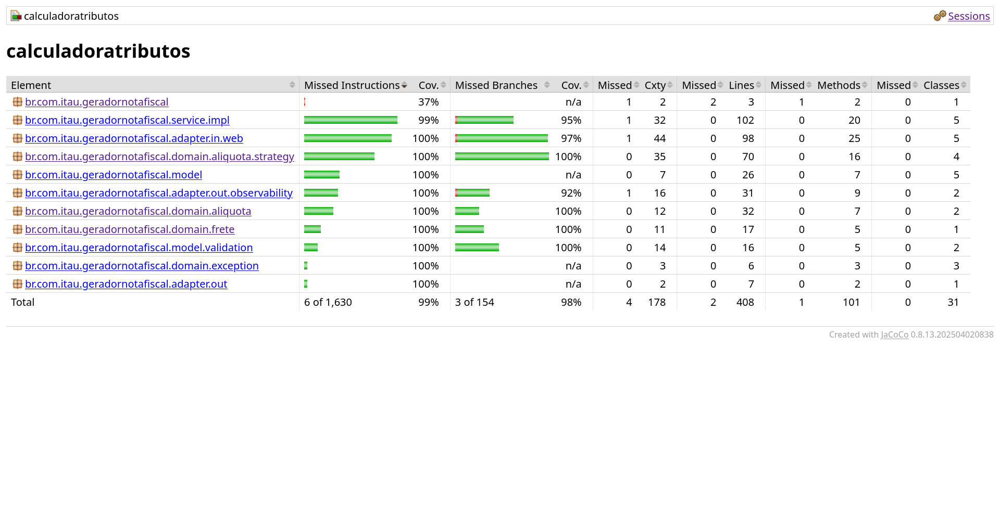

### TaaC (Bruno)

Collection em `tests/taac/collection`. Cinco requests contra a API no Compose:

| Request | O que garante |
| --- | --- |
| `pf` | PF, um item, tributo da linha. |
| `pf-segunda-chamada` | Segundo POST não herda itens do primeiro. |
| `pj-simples` | Regime Simples, frete com fator do Sudeste (2 casas). |
| `pedido-6-itens` | Seis linhas, tributo 12%, sem delay extra. |
| `total-divergente` | Total inconsistente → 422. |

Última execução: **5/5** requests, **13/13** assertions, **12/12** tests, 0 erros, duração ~3,5 s, tempo médio de resposta **420 ms**.

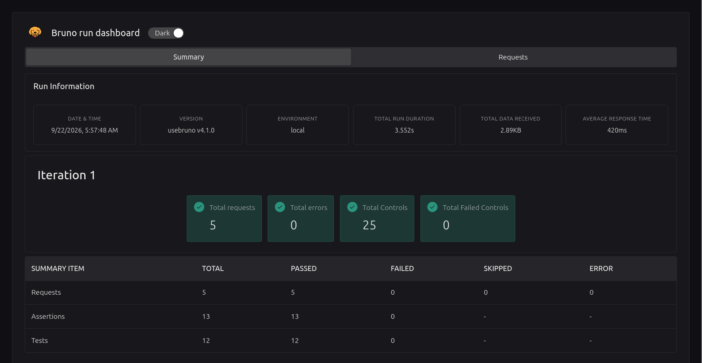

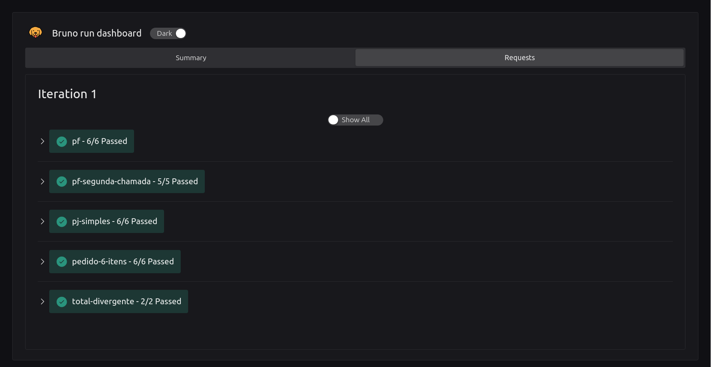

### Carga (k6)

Scripts em `tests/carga/`. Os quatro cenários abaixo são o baseline de latência e de regressão funcional sob tráfego.

| Cenário | Configuração | Checks |
| --- | --- | --- |
| `smoke` | 1 VU, 1 iteração | 200 PF e PJ, tributo da linha |
| `sequencial` | 1 VU, 8 iterações | 200, **não acumula itens**, tributo |
| `pedido-grande` | 1 VU, 3 iterações | 200, seis itens, tributo 12% |
| `carga` | 8 VUs, 30 s | 200, um item, tributo |

Relatórios JSON ficam em `tests/carga/reports/` (artefato local, não versionado). Prints da execução: seção de performance.

---

## Observabilidade

A aplicação **expõe**; Prometheus/Grafana/Datadog **consomem**. Não há agente na JVM neste recorte e não há traces: correlação é `requestId` no log + ids de pedido/nota. Detalhe da decisão em [ARD010](docs/adr/ARD010-OBSERVABILIDADE_ACTUATOR_MICROMETER.md).

### O que a JVM publica

| Sinal | Onde | Para quê |
| --- | --- | --- |
| Liveness / readiness | `/actuator/health/liveness`, `/readiness` | TaaC, k6 e orquestrador esperam o processo vivo — não o `GET /`. |
| Scrape OpenMetrics | `/actuator/prometheus` | HTTP server, JVM, GC, CPU, threads **e** métricas de negócio. |
| `nf.emitida` (counter) | tags `tipo_pessoa`, `regime` (`NA` se PF) | Quantas notas **saíram** (só depois das quatro integrações com sucesso). 4xx/422 e falha de lateral não incrementam. |
| `nf.gerar` (timer) | depois da conferência até o join | Tempo do caso de uso. p95/p99 **desta JVM** via `publishPercentiles`. |
| `nf.integracao` (timer) | tag `integracao=estoque\|registro\|entrega\|financeiro` | Cada lateral. p99 de `nf.gerar` acompanha o máximo (~registro), não a soma. |
| Log JSON (Logstash) | stdout | Uma linha por evento; `requestId` é **campo**, não substring da mensagem. Sem CPF/CNPJ. |
| `X-Request-Id` | header + MDC | Lê ou gera UUID, ecoa na resposta, `MDC.remove` no `finally` do filtro. Actuator não passa no filtro. Cópia do MDC nas virtual threads (`MdcPropagacao`). |

4xx: `warn` no Advice (`codigo` + `detail`). Fail-fast: `warn` com `id_pedido` / `id_nota_fiscal` / causa antes de relançar. 500: stack no `error`.

### Prometheus

Scrape local (profile `metrics`) em `http://127.0.0.1:9090`. Nomes no texto de scrape: `nf_emitida_total`, `nf_gerar_seconds_*`, `nf_integracao_seconds_*`.

`nf_emitida_total` após carga + TaaC: 1448 PF (`regime=NA`) e 3 PJ Simples — o counter de negócio, não o `http.server.requests` (este mistura 422 e `/actuator`).

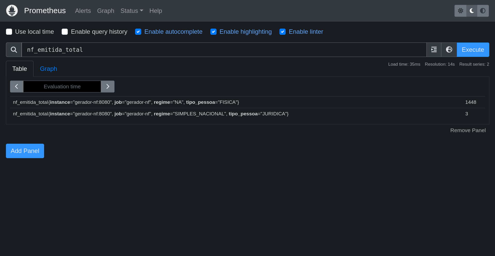

Timer `nf.gerar`: `count` / `sum` acumulam desde o start do processo; `quantile` 0.95 e 0.99 é janela móvel **desta** instância (não somar entre réplicas).

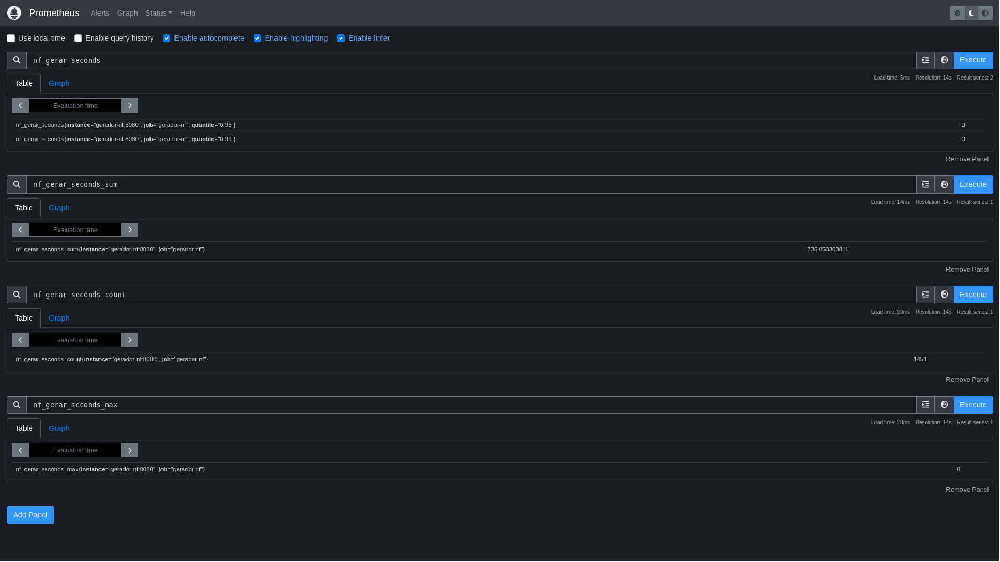

Cada lateral tem a mesma forma, com tag `integracao`:

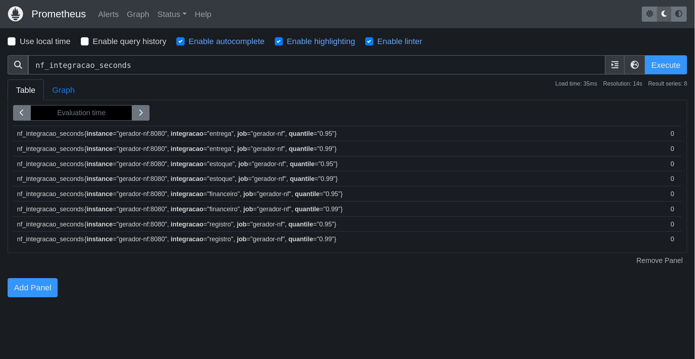

### Grafana

Dashboard provisionado *Gerador NF*: total de NF nesta JVM, taxa `rate(nf_emitida_total[1m])`, média das integrações e p99 de `nf.gerar` / `nf.integracao`. Na captura abaixo, ~1323 notas, taxa subindo com a carga, registro na média ~0,5 s e p99 de `gerar` colado no registro — evidência de que o paralelo está no máximo, não na soma.

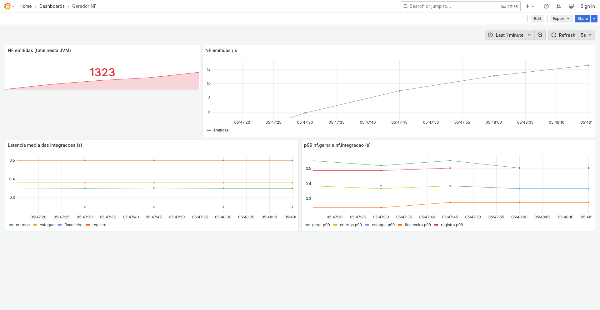

### Logs

Stdout em JSON. `requestId` no objeto; mensagem só com ids de pedido e nota.

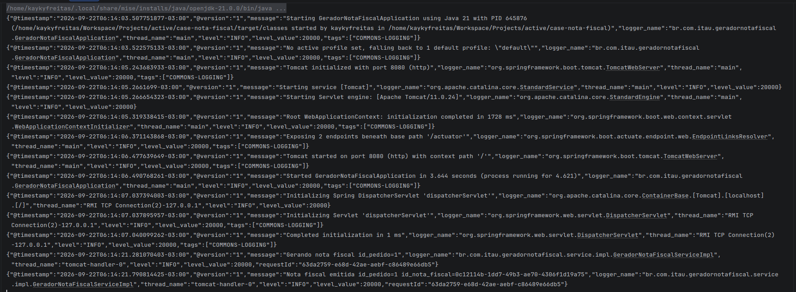

Com `DEBUG` no pacote do gerador, as quatro workers (`thread_name` `virtual-*`) repetem o mesmo `requestId` da thread HTTP — a cópia do MDC no `submit`:

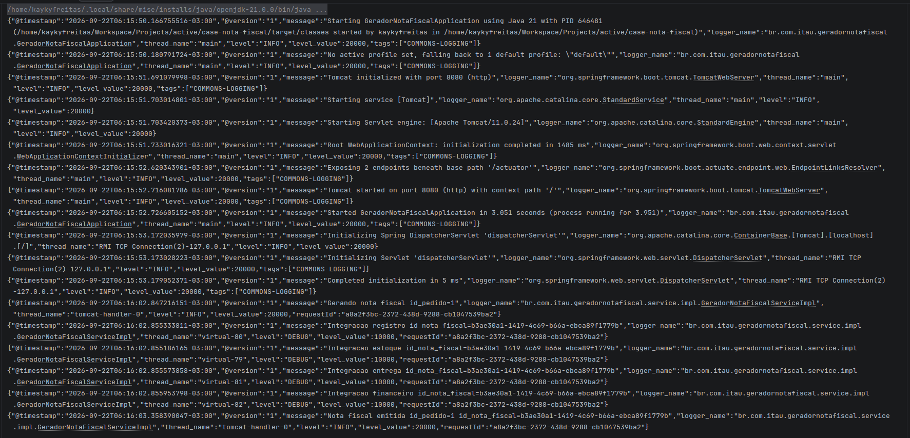

---

## Decisões (ADRs)

| ADR | Tema |
| --- | --- |
| [ARD001](docs/adr/ARD001-AMBIENTE_DOCKER_COMPOSE.md) | Docker Compose, cota de CPU/RAM, fuso |
| [ARD002](docs/adr/ARD002-BASELINE_TAAC_E_TESTES_DE_CARGA.md) | Baseline Bruno + k6 |
| [ARD003](docs/adr/ARD003-INTERFACES_E_INJECAO_DE_DEPENDENCIA.md) | Interfaces, DI, Port/Adapter na entrega |
| [ARD004](docs/adr/ARD004-STRATEGY_DE_ALIQUOTA.md) | Strategy de alíquota e tributo da linha |
| [ARD005](docs/adr/ARD005-CALCULO_DE_FRETE_E_ENUM_REGIAO.md) | Frete e fator no enum `Regiao` |
| [ARD006](docs/adr/ARD006-MODEL_COMPARTILHADO.md) | Model compartilhado (sem DTO 1:1) |
| [ARD007](docs/adr/ARD007-SANITIZACAO_E_VALIDACAO_DO_PEDIDO.md) | Sanitização, 400 vs 422 |
| [ARD008](docs/adr/ARD008-VIRTUAL_THREADS_E_FAIL_FAST_NAS_INTEGRACOES.md) | Virtual threads e fail-fast |
| [ARD009](docs/adr/ARD009-BIGDECIMAL_PARA_VALORES_MONETARIOS.md) | `BigDecimal` em dinheiro e alíquota |
| [ARD010](docs/adr/ARD010-OBSERVABILIDADE_ACTUATOR_MICROMETER.md) | Actuator, Micrometer, logs JSON |
